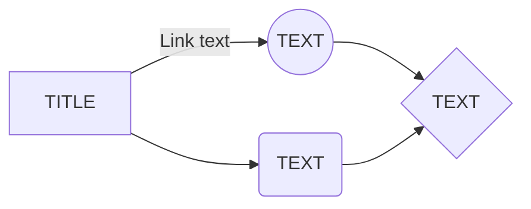

## `Цели занятия`

- [ ] Цель 1
- [ ] Цель 2
- [ ] Цель 3

---

## `Основные понятия`

- **Понятие 1**: Описание
- **Понятие 2**: Описание
- **Понятие 3**: Описание

---

## `Ключевые идеи`

1. **Идея 1**: Подробности
2. **Идея 2**: Подробности
3. **Идея 3**: Подробности

---

## `Заметки`

---

## `Дополнительные материалы`

- [Ссылка на источник 1](URL)
- [Ссылка на источник 2](URL)
- [Ссылка на источник 3](URL)

---

## `Рефлексия`

- Что нового я узнал?
- Как я могу применить эти знания?
- Какие вопросы остались?