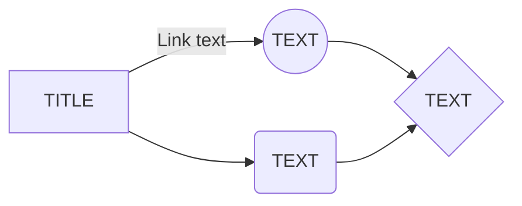

## `Lesson objectives`

- [ ] Goal 1
- [ ] Goal 2
- [ ] Goal 3

---

## `Basic concepts`

- **Concept 1**: Description
- **Concept 2**: Description
- **Concept 3**: Description

---

## `Key ideas`

1. **Idea 1**: Details
2. **Idea 2**: Details
3. **Idea 3**: Details

---

## `Notes`

---

## `Additional materials`

- [Link to source 1](URL)
- [Link to source 2](URL)
- [Link to source 3](URL)

---

## `Reflection`

- What have I learned?
- How can I apply this knowledge?
- What are the remaining questions?